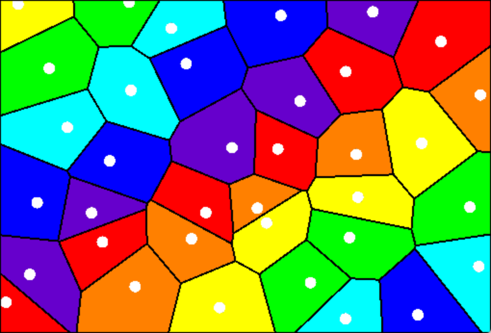

# Voronoi Visualizer
Visual aid for understanding what voronoi diagrams are.
Powered by [Voronoi](https://github.com/CooperCorona/Voronoi).
Generate random voronoi diagrams or input your own points to create a custom voronoi diagram.

### New Features
* Click anywhere in the diagram to add a new point.
* Drag a point to watch the diagram update in real time (only functions for diagrams with <= 64 points because diagrams with higher number of points take too long to render).
* Change coloring scheme to "Hover" mode and move your mouse to see which cells are neighbors to each other.
* "Mono" coloring mode colors all cells subtly different shades of the same color.

